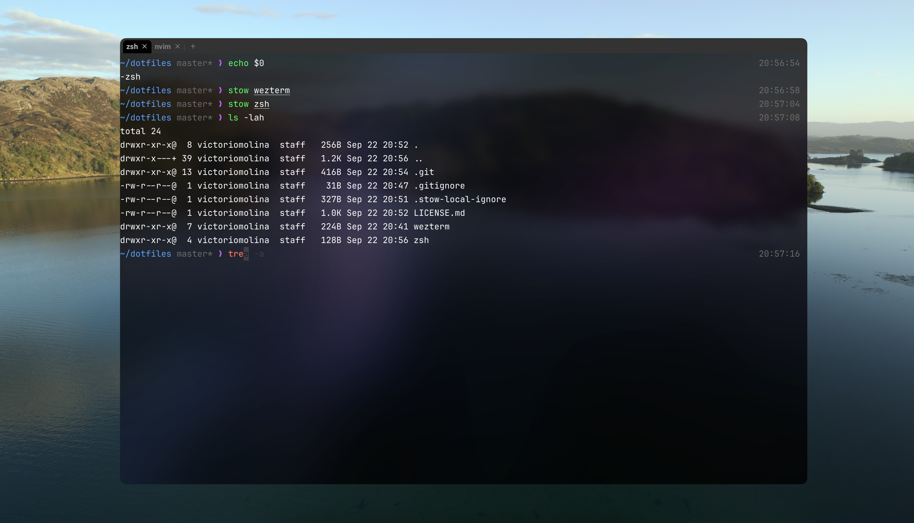
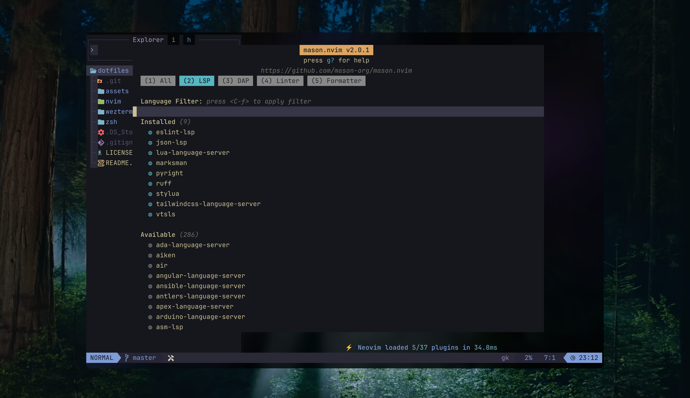

# dotfiles

Personal dotfiles for my development environment.

This repo contains my **terminal, shell, and productivity configs**, managed with [`stow`](https://www.gnu.org/software/stow/)

## Overview

## WezTerm keymap cheatsheet

| Shortcut         | Action                               |
| ---------------- | ------------------------------------ |
| Ctrl + Shift + F | Toggle full screen                   |
| Cmd + t          | New tab                              |
| Ctrl + Shift + ← | Move tab left                        |
| Ctrl + Shift + → | Move tab right                       |
| Ctrl + Shift + R | Rotate panes (clockwise)             |
| Cmd + Enter      | Smart split (horizontal or vertical) |
| Ctrl + Shift + % | Horizontal split                     |
| Ctrl + Shift + " | Vertical split                       |
| Cmd + ←          | Focus pane left                      |
| Cmd + →          | Focus pane right                     |
| Cmd + ↑          | Focus pane up                        |
| Cmd + ↓          | Focus pane down                      |
| Cmd + c          | Copy to clipboard                    |
| Cmd + v          | Paste from clipboard                 |
| Cmd + X          | Activate _Copy Mode_                 |
| Cmd + u          | Scroll up (half page)                |
| Cmd + d          | Scroll down (half page)              |

> Note: On Windows, replace _Cmd_ with _Ctrl_.

## LazyVim keymap cheatsheet

### Custom keymaps

| Shortcut              | Mode | Action                               |
| --------------------- | ---- | ------------------------------------ |
| Ctrl + z              | n/i  | Undo                                 |
| Ctrl + r              | n/i  | Redo                                 |
| Ctrl + c              | n    | Copy current line to clipboard       |
| Ctrl + c              | v    | Copy selection to clipboard          |
| Ctrl + c              | i    | Copy current line to clipboard       |
| Ctrl + x              | n    | Cut current line to clipboard        |
| Ctrl + x              | v    | Cut selection to clipboard           |
| Ctrl + x              | i    | Cut current line to clipboard        |
| Ctrl + v              | i    | Paste from clipboard                 |
| Ctrl + v              | v    | Paste over selection from clipboard  |
| Del / Backspace       | v    | Delete selection (no clipboard)      |
| Ctrl + a              | n    | Select all                           |
| Alt + Shift + Left    | n/i  | Select previous word                 |
| Alt + Shift + Right   | n/i  | Select next word                     |
| Alt + Shift + Left    | v    | Extend to previous word              |
| Alt + Shift + Right   | v    | Extend to next word                  |
| Shift + Left          | n/i  | Start selection and move left        |
| Shift + Right         | n/i  | Start selection and move right       |
| Shift + Up            | n/i  | Start selection and move up          |
| Shift + Down          | n/i  | Start selection and move down        |
| Shift + Left          | v    | Extend selection left                |
| Shift + Right         | v    | Extend selection right               |
| Shift + Up            | v    | Extend selection up                  |
| Shift + Down          | v    | Extend selection down                |
| Alt + Up              | n/i  | Move line up                         |
| Alt + Down            | n/i  | Move line down                       |
| Alt + Up              | v    | Move selection up                    |
| Alt + Down            | v    | Move selection down                  |
| Alt + Left            | n/i  | Move to previous word                |
| Alt + Right           | n/i  | Move to next word                    |
| Alt + Del / Alt + BS  | i    | Delete previous word                 |
| Tab                   | i    | Indent after cursor                  |
| Shift + Tab           | i    | Outdent current line                 |
| Tab                   | v    | Indent selection                     |
| Shift + Tab           | v    | Outdent selection                    |
| Ctrl + b              | n/i  | Move to start of line                |
| Ctrl + e              | n/i  | Move to end of line                  |
| Leader + Tab          | n    | Next buffer                          |
| Leader + Shift + Tab  | n    | Previous buffer                      |
| t e                   | n    | Open new tab                         |
| Tab                   | n    | Next tab                             |
| Shift + Tab           | n    | Previous tab                         |
| Ctrl + o              | n    | Jump back in jumplist                |
| Ctrl + i              | n    | Jump forward in jumplist             |
| Ctrl + u              | n/i  | Jump to start of file                |
| Ctrl + d              | n/i  | Jump to end of file                  |
| s h / s k / s j / s l | n    | Navigate between splits              |
| s s                   | n    | Horizontal split                     |
| s v                   | n    | Vertical split                       |
| Leader + q            | n    | Close buffer                         |
| Ctrl + w + Left       | n    | Resize pane left                     |
| Ctrl + w + Right      | n    | Resize pane right                    |
| Ctrl + w + Up         | n    | Resize pane up                       |
| Ctrl + w + Down       | n    | Resize pane down                     |
| Ctrl + j              | n    | Jump to next diagnostic (with float) |
| Plus (+)              | n    | Increment number                     |
| Minus (-)             | n    | Decrement number                     |

### Telescope keymaps

| Shortcut | Mode | Action                                                          |
| -------- | ---- | --------------------------------------------------------------- |
| ; f      | n    | Find files (hidden = true, respects .gitignore)                 |
| ; b      | n    | Open file browser in current buffer directory (hidden, grouped) |
| ; r      | n    | Live grep in current working directory (includes hidden files)  |
| ; e      | n    | Show diagnostics (all buffers or current buffer)                |
| ; ;      | n    | Resume last Telescope picker                                    |
| \ \      | n    | List open buffers                                               |

> Telescope documentation: https://github.com/nvim-telescope/telescope.nvim

### LazyVim defaults (essential keymaps)

| Shortcut             | Mode  | Action                            |
| -------------------- | ----- | --------------------------------- |
| **LSP & Code**       |       |                                   |
| g d                  | n     | Go to definition                  |
| g r                  | n     | Find references                   |
| g D                  | n     | Go to declaration                 |
| g y                  | n     | Go to type definition             |
| g I                  | n     | Go to implementation              |
| K                    | n     | Hover documentation               |
| g K                  | n     | Signature help                    |
| Leader + c a         | n/v   | Code action                       |
| Leader + c r         | n     | Rename symbol                     |
| Leader + c f         | n/v   | Format code                       |
| Leader + c l         | n     | LSP info                          |
| **File & Search**    |       |                                   |
| Leader + e           | n     | Toggle file explorer (Snack)      |
| Leader + Space       | n     | Find files (Telescope)            |
| Leader + f f         | n     | Find files (Root Dir)             |
| Leader + f F         | n     | Find files (cwd)                  |
| Leader + f g         | n     | Find files (git-files)            |
| Leader + f r         | n     | Recent files                      |
| Leader + f b         | n     | Find buffer                       |
| Leader + /           | n     | Live grep (Root Dir)              |
| Leader + s g         | n     | Live grep (Root Dir)              |
| Leader + s G         | n     | Live grep (cwd)                   |
| Leader + s w         | n/x   | Search word under cursor          |
| Leader + s h         | n     | Find help pages                   |
| Leader + s k         | n     | Find keymaps                      |
| Leader + s c         | n     | Command history                   |
| Leader + s R         | n     | Resume last search                |
| **Diagnostics**      |       |                                   |
| ] d / [ d            | n     | Next / Previous diagnostic        |
| ] e / [ e            | n     | Next / Previous error             |
| ] w / [ w            | n     | Next / Previous warning           |
| Leader + c d         | n     | Line diagnostics                  |
| Leader + s d         | n     | Document diagnostics              |
| Leader + x x         | n     | Diagnostics (Trouble)             |
| **Buffers & Tabs**   |       |                                   |
| Shift + h            | n     | Previous buffer                   |
| Shift + l            | n     | Next buffer                       |
| ] b / [ b            | n     | Next / Previous buffer            |
| Leader + b d         | n     | Delete buffer                     |
| Leader + b b         | n     | Switch to other buffer            |
| Leader + `           | n     | Switch to other buffer            |
| Leader + Tab l       | n     | Last tab                          |
| Leader + Tab Tab     | n     | New tab                           |
| Leader + Tab ]       | n     | Next tab                          |
| Leader + Tab [       | n     | Previous tab                      |
| Leader + Tab d       | n     | Close tab                         |
| **Windows & Splits** |       |                                   |
| Ctrl + h             | n     | Go to left window                 |
| Ctrl + j             | n     | Go to lower window                |
| Ctrl + k             | n     | Go to upper window                |
| Ctrl + l             | n     | Go to right window                |
| Leader + -           | n     | Split window below                |
| Leader + \|          | n     | Split window right                |
| Leader + w d         | n     | Delete window                     |
| Ctrl + Up            | n     | Increase window height            |
| Ctrl + Down          | n     | Decrease window height            |
| Ctrl + Left          | n     | Decrease window width             |
| Ctrl + Right         | n     | Increase window width             |
| **Terminal**         |       |                                   |
| Leader + f t         | n     | Terminal (Root Dir)               |
| Leader + f T         | n     | Terminal (cwd)                    |
| Ctrl + /             | n     | Terminal (Root Dir)               |
| Ctrl + /             | t     | Hide terminal                     |
| **Git**              |       |                                   |
| Leader + g s         | n     | Git status                        |
| Leader + g d         | n     | Git diff (hunks)                  |
| Leader + g b         | n     | Git blame line                    |
| Leader + g B         | n/x   | Git browse (open)                 |
| **Text Objects**     |       |                                   |
| c i w                | n     | Change inner word                 |
| c a w                | n     | Change around word                |
| d i w                | n     | Delete inner word                 |
| d a w                | n     | Delete around word                |
| d d                  | n     | Delete current line               |
| d w                  | n     | Delete word forward               |
| d b                  | n     | Delete word backward              |
| y y                  | n     | Yank (copy) current line          |
| y i w                | n     | Yank inner word                   |
| **Movement**         |       |                                   |
| w                    | n     | Next word                         |
| b                    | n     | Previous word                     |
| e                    | n     | End of word                       |
| 0                    | n     | Start of line                     |
| $                    | n     | End of line                       |
| g g                  | n     | Go to top of file                 |
| G                    | n     | Go to bottom of file              |
| Ctrl + u             | n     | Scroll up half page               |
| Ctrl + d             | n     | Scroll down half page             |
| **Visual Mode**      |       |                                   |
| v                    | n     | Enter visual mode                 |
| V                    | n     | Enter visual line mode            |
| Ctrl + v             | n     | Enter visual block mode           |
| o                    | v     | Go to other end of selection      |
| **Toggles**          |       |                                   |
| Leader + u w         | n     | Toggle word wrap                  |
| Leader + u l         | n     | Toggle line numbers               |
| Leader + u d         | n     | Toggle diagnostics                |
| Leader + u s         | n     | Toggle spelling                   |
| Leader + u f         | n     | Toggle auto format (global)       |
| Leader + u F         | n     | Toggle auto format (buffer)       |
| Leader + u c         | n     | Toggle conceal level              |
| **Quick Actions**    |       |                                   |
| Ctrl + s             | i/n/v | Save file                         |
| Leader + q q         | n     | Quit all                          |
| Esc                  | i/n   | Escape and clear search highlight |
| n / N                | n     | Next / Previous search result     |
| \* / #               | n     | Search word under cursor fwd/bwd  |

> For the **full LazyVim keymap reference** (including plugins and advanced commands), check the official docs: [https://www.lazyvim.org/keymaps](https://www.lazyvim.org/keymaps)
